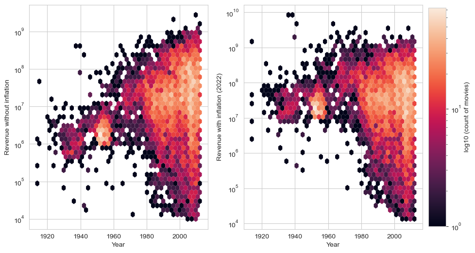
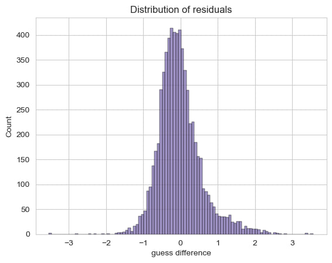
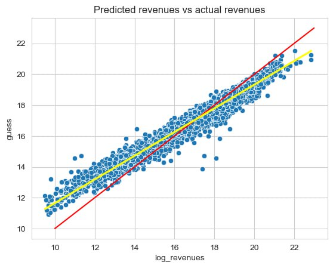

<!-- <link rel="stylesheet" type="text/css" href=""> -->
 

  

  First, allow us to introduce <strong> Professor Zokomo Predicto</strong>,
the charismatic bear with a nose for cinematic success!
With a furiously brilliant mind and a heart as warm as his fuzzy exterior, 
Zokomo is here to unveil the revolutionary tool that will predict the triumphs of your movie before
the first frame is even shot. Not only it identifies the elements your movie 
might be lacking but also imparts invaluable lessons gleaned from the triumphs of 
films that defied expectations. Get ready to embark on a cinematic journey like never before !

<h2 class="red-heading">"How much do they earn ?!"</h2>
<h3  style="color: rgb(190, 30, 0);">Revenues</h3>

"The CMU Movie Summary Corpus Dataset consists of 42,306 plot summaries and its meta data from movies,
released from 1893 until 2013. 
Consider the box office revenues," he starts, his voice brimming with enthusiasm. 

<iframe src="assets/plots/box_office_distribution.html" width="100%" height="500px" style="border: none;"></iframe>

"The distribution you see is heavily skewed,
characterized by a small number of movies attaining
exceptionally high revenues. To truly understand this pattern,
I am applying a logarithmic transformation to the revenue data,
thereby smoothing out these spikes and approximating a normal distribution.
This step is essential to make the data more amenable for the sophisticated statistical analyses that follow."

<h3 style="color: rgb(190, 30, 0);">Inflation</h3>

"Before starting the feature analysis, a key transformation remains. 
The revenues being spread over a century, it wouldn't be a fair to compare the success of old 
films with the recent ones. To address this issue, I am adjusting the revenues for inflation, using 
the Consumer Price Index (CPI) to convert the revenues to 2022 dollars. Thus, we can also have a nowadays
perspective on the revenues. HAHAHA! I am so smart!"

"We can see that it has effectively highered older revenues, and it is actually resulting in a more similar distribution across the years. Two points to note :
    \n - the highest old revenues have now surpassed the other. The inflation had huge impact on them and made them outliers.
    - even the most recent revenues have been inflated since we are considering the inflation to 2022, to make it more reprensentative for us."

He pauses for a moment, then proceeds :

<h2 class="red-heading">"I DECLARE THE START OF FEATURE ANALYSIS !"</h2>

<h3 style="color: rgb(190, 30, 0);">Genres</h3>

"Listen my dear, be careful when analysing a feature that has many distinct values.
Some of them might be poorly represented ! Here for example, before analysing the genres, I took care to select only
the ones that appeared in at least 500 movies of my dataset. What to do with the remaining genres ? Simply drop th... 
keep them carefully in a grouped category so you can consider them as a whole... of course !"

<iframe src="assets/plots/genre_revenue.html" width="100%" height="680px" style="border: none;"></iframe>
" Well, well, well, you would better make a film about fantasy, family films, adventures, science fiction, 
action or action/adventure if you want to make money ! On the other hand we can acknowledge that producers
of indie and world cinema genres are true passionates.

<h3 style="color: rgb(190, 30, 0);">Emotions</h3>

With a seamless transition, Zokomo shifted the focus to movie summaries. "Now, let's consider the language of cinema, as captured in movie summaries. Here we uncover a pattern more intriguing: the emotional charge of words. Positive and negative sentiments from words used in summaries, ranging from 0 to 10 percent, interspersed with a majority of neutral expressions," he details, his finger tracing the shape of the graphs in the air.

"The correlation between positivity in summaries and box office earnings is particularly shocking. Our analysis suggests that movies with a modest percentage of positivity, particularly those with 0 to 2 percent of feel-good words, yield the highest returns, while summaries overfilled with cheerfulness seem to correlate with lesser earnings," he observes, the surprise in his tone mirroring that of his audience.

<iframe src='assets/plots/pos_neg_revenue.html' width="100%" height="500px" style="border: none;"></iframe>

Clicking on the "Negative sentiments" button, he continues, "On the flip side, when we explore the percentage of words with negative sentiments, we see another fascinating trend. The sweet spot for box office success lies subtly between 2 to 4 percent of negative words, with the interval of 2 to 4 percent being particularly golden. In summary, it is the equilibrium of emotion that appears to be most profitable. Films whose summaries are rich in neutral words, with just a hint of emotional undertones, seem to strike the right chord with audiences, leading to a more robust box office performance."

<h3 style="color: rgb(190, 30, 0);">Actors</h3>

Zokomo indicates that from now on, as in many following feature analysis, he will be averaging log_revenues instead of averaging revenues. He says "This corresponds to computing the geometric mean instead of an arithmetic mean with the objective of gaining statistical stability. The geometric mean tends to be less sensitive to extreme values (outliers) compared to the arithmetic mean. This makes it a more robust measure in situations where there are significant variations in the data, since it represents better the central tendency. In my case, it is useful to penalize the big variances in revenues thus focusing on the consistency of the contribution of the analysed feature."

"Here we have a visual representation of the average revenues for the top 25 actors," Professor Zokomo adds. "This chart employs the geometric mean to emphasize consistent performance across varied careers, reducing the emphasis on occasional, high-grossing outliers. It's a clear indicator of who truly commands the box office."

<iframe src="assets/plots/actors_revenue.html" width="100%" height="500px" style="border: none;"></iframe>

"Consider the prime example of Tom Cruise," Zokomo continued, gesturing towards the peak performers on the graph. "His position on this chart is no accident. It's the result of a career that consistently delivers, film after film, as opposed to a few high-grossing anomalies."

Zokomo also says: " With geometric mean for actors, I am favoring those with consistent success over the ones who only participated in a few hits. A clear demonstration is that selecting the top actors with arithmetic mean results in many actors from harry potter or other sagas. This is because there are many films in these sagas with high revenues, which is boosting the actors mean revenues despite them not having much successful movies. "

<h3 style="color: rgb(190, 30, 0);">Runtimes</h3>

Our smart guy continues: “Behold the curious relationship between a movie’s duration and its box office revenue." 
<iframe src="assets/plots/runtime_revenue.html" width="100%" height="500px" style="border: none;"></iframe>

The professor continues "We can first see that exceeding 2h leads to a big increase in revenue compared to the lower runtimes. It looks like an important threshold to reach. It is still significantly increasing when passing from 2h-2h30 to 2h30-3h but past that point, even if it looks like the revenue continues to grow, we don't have significant difference between the 3 following intervals since their ci overlap. As it seems that film lasting 3h30 to 4h earns the most, the key point is exceeding at least 2h, if possible 2h30. Finally we observe a drop for films with more than 4h as we could have expected. We can also see that the 4h+ movies have a very high variance, which can be explained since there are very few movies with such a long runtime."

He switches to the other colorful box plot. "On the boxplot we notice that the median (top50%) 
of films with runtime between 2h and 2h30 is at the same level as the first quartile (top25%) of the movies with runtime between 1h30 and 2h. Said otherwise, 50% of films between 2h and 2h30 have a higher revenue than 75% of films between 1h30 and 2h. This is a big difference of revenue for such a small difference of runtime."

<h2 class="red-heading">"It's taking shape !" </h2>

  <strong>Zokomo Predicto</strong> smiles warmly and says, "I'll be honest with you all, I was a bit worried at first. I wasn't sure I'd find anything useful in all these numbers and charts. But look at the results now! I've got some great results that tell us a lot about movies and money. And you know what? I'm really excited to keep going and see what else we can learn about what makes a movie successful. So, let's keep exploring!"

<h3 style="color: rgb(190, 30, 0);">Countries and languages</h3>

"Now, let us journey through the linguistic landscape of cinema !" tells Zokomo suddenly. 
He comes up with a very interesting point: "Since countries and languages are by essence correlated, we will analyze them together. The goal is first to see how relevant they are in the process of predicting the box office revenue individually, and then verify if they are actually both proxying the same information." The professor generates the following graph.

  <!-- First iframe for languages -->
  <iframe src="assets/plots/languages.html" width="48%" height="500px" style="border: none;"></iframe>

  <!-- Second iframe for countries -->
  <iframe src="assets/plots/countries.html" width="48%" height="500px" style="border: none;"></iframe>

He warns us "the interpretations that I am about to make are only assumptions and we would need further causal analysis to get more insights". He begins "when analysing features independently, US and english were high above the rest, and we would believe that they are both very impactful features on revenue. However, when analysing them together, we notice a big drop for english language, indicating that this feature was capturing a lot of information from the countries. We can imagine that it was benefiting from the success of the US, which is the biggest market for movies. On the other hand, US coefficient didn't change much, so it seems that the defining factor isn't much the english language but rather the US market... Aha !" Zokomo continues with his interpretations "Excluding the US, the average coefficient of the languages is higher than the average coefficient of the countries, indicating that languages are a better indicator of revenue than countries. Combined, english isn't even first anymore and has been doubled by french that encountered the highest increase across all languages. Yet, France is also the country that lowered the most. In the global growth of languages and decrease of countries, France and french were affected the most."

<h3 style="color: rgb(190, 30, 0);">Months</h3>

Our bear is stunned by the results he got. Then, he continues the data analysis by pointing the plot of the log revenue for each month.

<iframe src="assets/plots/months_revenue.html" width="100%" height="500px" style="border: none;"></iframe>

"It appears," he announces with a hint of revelation in his voice, "that the prime season to debut a film is indeed June, with a marked advantage in box office returns. December and July follow, aligning neatly with the student holidays."

<h3 style="color: rgb(190, 30, 0);">Gender</h3>

With the same thoughtful consideration, Zokomo approaches the delicate balance of gender representation in films. He aims to dissect the percentages of female actors into equal groups, each representing a slice of the cinematic pie. "This categorization allows us to more accurately parse out the influence of actresses representation on a film's financial outcome" he states. He decides to analyze whether there is a particular proportion that generates higher box office revenues. To this extend, he is studying the percentage of actresses in movies and how they relate to the box office revenues.

For that, our scientist is trying to perform an equal frequency discretization of the percentage of women, dividing percentages into 8 groups where there is an equal number of movies in each group. He thinks that by doing it this way, then instead of feeding the final prediction formula with an actual percentage of women, he will only use categorical variables.

<iframe src="assets/plots/women_revenue.html" width="100%" height="500px" style="border: none;"></iframe>

Pointing to the plot, Zokomo says: " We notice that movies with women percentages between 15% and 21% result in significantly higher box office revenues, followed by movies that have women percentages between 34% and 38%. While movies with 45% to 100% have significantly lower mean box office revenues, and their confidence intervals don't intersect with other intervals."

<h2 class="red-heading">"Zokomo ? What are you doing ?" </h2>

"Our findings here are not merely data points. The art of Film making is a complex interplay of timing, storytelling, and the representation of characters that beckons audiences into theaters. These insights pave our path to uncovering what might be the alchemical formula for box office gold." Proudly, Zokomo turns to ZokAda, his wife who shares his passion for cinematic analytics.

ZokAda closely followed Zokomo's work. With her findings in hand, she is ready to explain her research about the formula. Her initial goal had been to determine a magic formula that could predict a film's revenue based on the features Zokomo had meticulously analyzed.

<h2 class="red-heading">" Let me finish what my husband started " </h2>

Zokada was determined to uncover the hidden gems within the world of cinema, the movies that defied the traditional notions of success. With a dataset boasting 50 parameters, including months, genres, percentages of positive and negative words, languages, and countries, she was armed with a treasure trove of information.

"Random forests were my first stop," Zokada recountes, "I wanted to see how these factors interacted with the revenues of movies, specifically their logarithmic values. I used random forests to perform predictions of revenues based on the different features we analyzed. The results were revealing. It gave me an R-squared coefficient of about 0.9 and an mean absolute error (MAE) of 0.43. 

  <!-- First iframe for languages -->

  <!-- Second iframe for countries -->

 "The plot on the left, concerning the prediction of the revenue using only the initial features presented by my husband, exhibits a broad spread of residuals, the difference between predicted movie revenues and the actual revenues, indicating that the initial model has a wide variance in prediction accuracy. This broad distribution suggests that while the model captures the general trend, there's a considerable amount of error in its predictions."

Continuing the analysis, "The plot on the right," Zokada points out, " showing the prediction of the revenue using the initial and additional features, presents a much narrower and more pronounced peak in the distribution of residuals, which points to the majority of the model's predictions being very close to the true values. This sharp peak implies that the inclusion of additional features has likely led to a substantial enhancement in the model's predictive accuracy."

"It was a moment of clarity for me. The relationships between a movie's financial resources, its production background, and how it's ratings were far more predictive of its revenue than I had initially thought !"

Zokada's journey into the analytics of regression formula was beginning to bear fruit, revealing the nuanced layers of what truly drives a movie's success. She had peeled the superficial layers of her analysis to uncover deeper insights.

<h2 class="red-heading">" It's time to turn my attention to the outliers ! " </h2>

"Now, I need to shift my focus to the outliers." Zokada thinks, " These are the films that don't fit the pattern, the ones that either wildly exceed or fall short of expectations. Understanding these anomalies could offer valuable lessons, shining light on the unpredictable elements of the film industry."

Zakada continues, "In my model, I've decided to label as outliers the 10 data points that have biggest positive residuals, and the 10 datapoints that have smallest negative residuals, depending on whether it's an overestimation or an underestimation." Zokada says, sharing her thoughts on categorizing outliers in her analysis, " This criterion helps me identify movies where our predictions are significantly off. I'm classifying these outliers into two groups: 'below outliers,' where we've underestimated the revenue, and 'above outliers,' where we've overestimated it. By separating them, 
I can tackle each case differently and understand why our predictions didn't match reality in each scenario."

Zokada then explores the results of her outlier analysis:

"Using the two outlier groups I identified, I conducted a further investigation to find patterns specific to each. For each group, I compiled a list of features, but with an interesting twist: I only included features where less than 50% of their total distinct values were represented. This meant I was focusing on features that showed a concentrated pattern in either the 'below outliers' or the 'above outliers' group."

"As I move forward with my analysis," Zokada explains, "I'm focusing on each outlier group separately, investigating how specific values within each feature contribute to the variance between the predicted and actual revenues. I'll be closely examining to uncover the unique effects and patterns that might explain why certain films didn't align with our initial revenue predictions."

"We will now analyze the features of these outliers. We will look at the most recurrent features amongst movies that should've worked, and amongst movies that should've not worked."

<iframe src="assets/plots/pos_outliers.html" width="100%" height="500px" style="border: none;"></iframe>
Zokada says, "Above, we can see the most recurrent features among movies that should've worked but that did not. Our model failed to accurately predict the box office revenues of these movies, and overestimated it. Indeed, we can see that these movies are all in English, nine of them are made in the USA, some of them even contain actors among the top 20 and top 50 best actors. They thus, had all the ingredients to be perfect hits. The failure of the prediction can be explained by the presence of unobserved covariates, such as the plot quality which could greatly influence the results."

<iframe src="assets/plots/neg_outliers.html" width="100%" height="500px" style="border: none;"></iframe>

She takes a deep breath, and finally says "Above, we can see the most recurrent features among movies that should've not worked but that finally did. This time, our model underestimated the movies. As we saw, Indie genre is the feature that influences the box office the most, and in a negative way. Among the 10 outliers, 4 of them have Indie genre, suggesting that our predictive model directly underestimated these movies and predicted a way lower box office than what they should've got, but obviously, there exists Indie movies that eventually work out. The same argument can be applied to the run time interval. Among the 10 movies, 7 are between 1h30 and 2h, and as we saw in our feature analysis, movies with such runtimes usually have low box office, but again, there exists some exception which explains these outliers."

"Thank you all for joining us on this fascinating journey through the intricate world of cinema analytics," Professor Zokomo begins, his voice resonating with genuine appreciation. "Your attention, questions, and insights have greatly enriched this presentation. A special thanks to Mr. West and our dedicated teaching assistants for their unwavering support and guidance throughout this project."

He pauses, a smile spreading across his face. "It's been an extraordinary adventure, delving into the depths of movie data, unearthing patterns, and developing predictive tools. This journey has not only deepened our understanding of the film industry but has also been a testament to the power of data analysis in unraveling complex narratives."

<h2 class="red-heading">Few days later... </h2>

The comprehensive and insightful nature of his project, which brilliantly combined data science with cinematic expertise, did not go unnoticed.

Shortly thereafter, he was awarded the prestigious 'Best Project Award', a testament to the hard work, dedication, and ingenuity he brought to his research. This accolade highlighted not only the project's excellence but also its potential impact on the film industry and data analysis methodologies.

The achievements didn't stop there. Impressed by the excellence of his work, Professor West extended an invitation to Professor Zokomo to join the esteemed D-Lab as a Data Analyst. Recognizing the value and opportunity this offered, Professor Zokomo accepted the invitation immediately. His acceptance marked the beginning of an exciting new chapter in his career, promising further advancements and contributions in the field of data science.

This culmination of events - the award and the new role at D-Lab - signified not only a personal triumph for Professor Zokomo but also a moment of advancement in the synergy between data analytics and the creative arts.

<h2 class="red-heading">THE END. </h2>