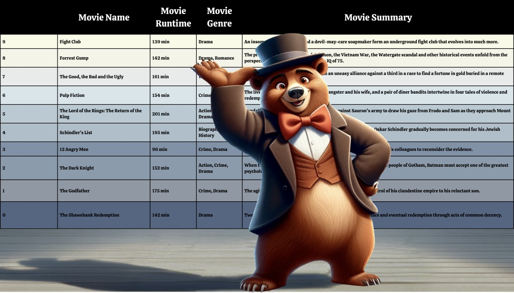
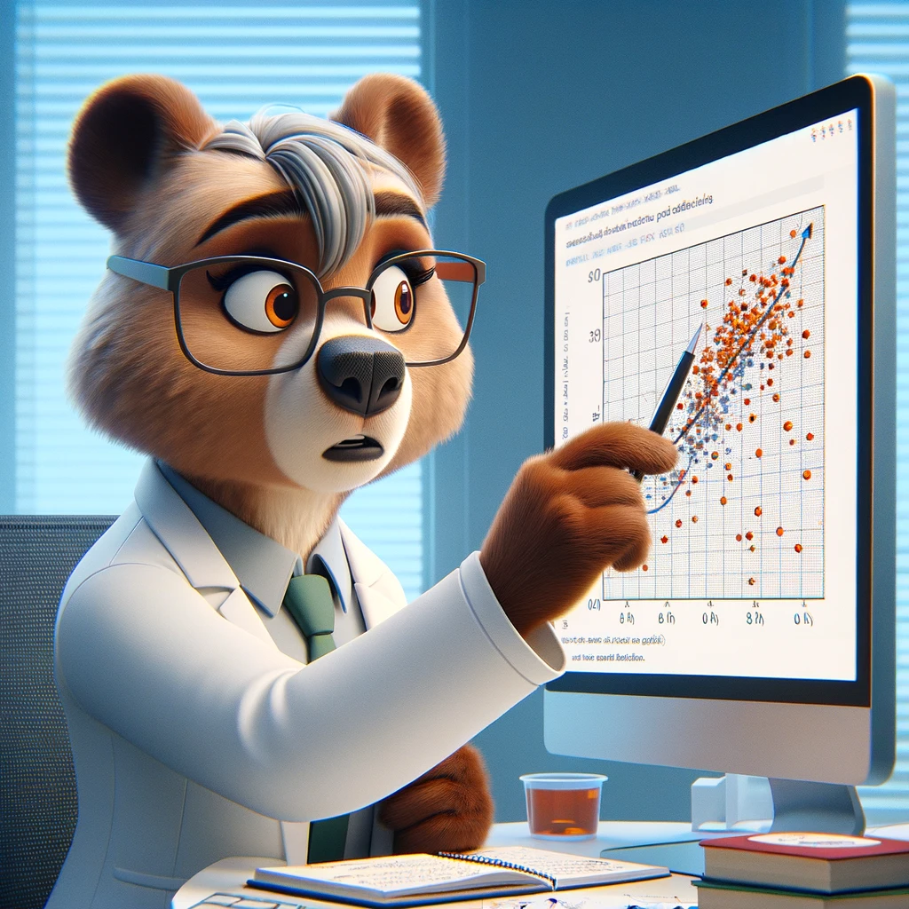

<!-- <link rel="stylesheet" type="text/css" href=""> -->

  Imagine possessing a revolutionary tool capable of predicting the success of your movie even before the cameras start rolling.
  This extraordinary tool not only identifies the elements your movie might be lacking but also imparts invaluable lessons gleaned from the triumphs of films that defied expectations. 
  Please join us, Mr. West and the esteemed TAs as we embark on an exploration of the origins and development of this groundbreaking tool.
  

  

  First, allow us to introduce <strong> Professor ZokOmo Predicto</strong>, the charismatic bear with a nose for cinematic success! With a furiously brilliant mind and a heart as warm as his fuzzy exterior, ZokOmo is here to unveil the revolutionary tool that will predict the triumphs of your movie before the first frame is even shot. Get ready to embark on a cinematic journey like never before !

<h2 class="red-heading">"Let me tell you a little story about data"</h2>

"The CMU Movie Summary Corpus Dataset consists of 42,306 plot summaries and its meta data from movies, released from 1893 until 2013. 

Consider the box office revenues," he starts, his voice brimming with enthusiasm. 

<iframe src="assets/plots/box_office_distribution.html" width="100%" height="500px" style="border: none;"></iframe>

"The distribution you see is heavily skewed. To truly understand this pattern, I am applying a logarithmic transformation to the revenue data, thereby smoothing out these spikes and approximating a normal distribution. This step is essential for the sophisticated statistical analyses that follow."

He pauses for a moment, then proceeds, "let's start exploring the 23 distinctive genres where 22 genres stand individually, each with its unique identity, while the 23rd represents all remaining genres."

<iframe src="assets/plots/genre_revenue.html" width="100%" height="500px" style="border: none;"></iframe>

" At the very top of this list is the fantasy genre, making the most money on average. Following closely are family films, adventures, science fiction, and action genres, each contributing substantially to the financial symphony of the film industry. However, as the plot deepens, a nuanced reality surfaces. Toward the bottom of the list, the indie and world cinema genres come into focus." he added, acknowledging the value of diversity in films.

With a seamless transition, Professor ZokOmo shifted the focus to movie summaries. "Now, let's consider the language of cinema, as captured in movie summaries. Here we uncover a pattern most intriguing: the emotional charge of words. Positive and negative sentiments, ranging from 0 to 10 percent, interspersed with a majority of neutral expressions," he detailed, his finger tracing the shape of the graphs in the air.

"The correlation between positivity in summaries and box office earnings is particularly shocking. Our analysis suggests that movies with a modest percentage of positivity, particularly those with 0 to 2 percent of feel-good words, yield the highest returns, while summaries overfilled with cheerfulness seem to correlate with lesser earnings," he observed, the surprise in his tone mirroring that of his audience.

<iframe src='assets/plots/pos_neg_revenue.html' width="100%" height="500px" style="border: none;"></iframe>

Clicking on the "Negative words" button, he continued, "On the flip side, when we explore the percentage of negative words, we see another fascinating trend. The sweet spot for box office success lies subtly between 2 to 4 percent of negative words, with the interval of 2 to 4 percent being particularly golden. In summary, it is the equilibrium of emotion that appears to be most profitable. Films whose summaries are rich in neutral words, with just a hint of emotional undertones, seem to strike the right chord with audiences, leading to a more robust box office performance."

Our smart Professor continues: "Behold the curious relationship between a movie's duration and its box office revenue. This chart here uncovers a golden sweet spot, films ranging between 3 and 4 hours in duration appear to hit the jackpot in revenue generation."

<iframe src="assets/plots/runtime_revenue.html" width="100%" height="500px" style="border: none;"></iframe>

He switches to the other colorful box plot. "These initial three segments," he indicates the blue, red, and green boxes, "show considerable variability in earnings. It's a cinematic landscape rife with peaks and valleys." Professor ZokOmo leans in, as if sharing a secret with his audience. "Now, observe the interval between 3 to 4 hours. Here lies our pinnacle of profitability the fourth interval. The data points cluster tightly around the mean, with the median revenue standing proudly alongside. It's a harmonious distribution, scarce in outliers, indicative of a reliable return on investment."

With a nod and a knowing smile, he teases "In the grand finale of their quest, movies that are between 3 and 4 hours long make more money than all the other movies, whether they are longer or shorter."

  <strong>Professor Zokomo Predicto</strong> smiles warmly and says, "I'll be honest with you all, I was a bit worried at first. I wasn't sure we'd find anything useful in all these numbers and charts. But look at us now! We've got some great results that tell us a lot about movies and money. And you know what? I'm really excited to keep going and see what else we can learn about what makes a movie successful. So, let's keep exploring!"

Zokomo generates a bar chart that illustrates the average movie revenues adjusted for inflation across the most frequently used languages in his dataset. Then, he begins to unravel the next chapter of his analytical saga. "Now, let us journey through the linguistic landscape of cinema," he announces, pointing towards the first chart. " The chart reveals that languages such as Arabic and Russian tend to have higher average revenues. Surprisingly, the categories of English and Korean, on the other hand, exhibit lower average revenues, which is somewhat unexpected."

<iframe src="assets/plots/languages_bar_plot.html" width="100%" height="500px" style="border: none;"></iframe>

Zokomo plots then a bar chart that shows the mean log revenue for each selected language with 95% confidence intervals. He also creates a box plot demonstrating the distribution of logarithmic movie revenues for selected languages. Then he continued: "Here we see the revenue distribution for movies in different languages, presented logarithmically. It's fascinating to observe how some languages, like Italian, achieve high average revenues, yet with a wide range of outcomes. Korean, on the other hand, displays a modest revenue performance."

<iframe src="assets/plots/language_revenue.html" width="100%" height="500px" style="border: none;"></iframe>

He clicks on the box plot button and continues " We can notice that English and Korean languages show a greater range and many outliers. In particular, English displays a wide range, which is expected given the large number of English language films, including both high-revenue and lower-revenue films. However, languages such as Standard Mandarin and Cantonese show zero outliers, which implies a more consistent revenue performance across films in those languages"

Then, with a swift gesture, he shifts the audience's attention to the following visualization. "But when we look at the revenue by country, the bar chart here !"

<iframe src="assets/plots/countries_bar_plot.html" width="100%" height="500px" style="border: none;"></iframe>

He points to the bold red bars " These bars reveal that the mean revenue per country, shows substantial variations across different countries. The United States of America, United Kingdom, Australia and Germany demonstrate particularly high mean revenues, indicating a strong performance for films from these countries. Conversely, countries like Italy, Canada, France, Japan and Spain show relatively lower mean revenues, though they still contribute significantly to the global film industry. In contrast, South Korea's mean revenue is on the lowest side.

Zokomo employs then a box plot to illustrate the distribution of logarithmic movie revenues in countries that feature at least 50 movies in their dataset.

<iframe src="assets/plots/countries_box_plot.html" width="100%" height="500px" style="border: none;"></iframe>

Professor Predicto leans closer to the box plot beneath, his eyes tracing the medians and outliers. "The median log revenue remains relatively consistent across countries, with a few exceptions displaying higher or lower median revenues. Notably, countries such as the United States of America exhibit a broader range of log revenues, indicating substantial variability in their movie earnings.

While many countries display numerous outliers on the lower end of the revenue spectrum, only the United States of America stands out with outliers on the higher end. This observation suggests that the USA has movies with revenues significantly exceeding the typical range, potentially attributable to the fact that a substantial proportion of movies are produced there."

Zokomo's assessment suggests that choosing to produce a movie in the USA is an attractive option for producers who are willing to take some risks. Despite the inherent risk of falling below the average American movie revenue, by the presence of numerous low outliers, the USA stands out as the only country with high outliers, implying the possibility of achieving a more predictable, substantial revenue and even experiencing remarkable financial success. While this decision carries its share of risk, it may ultimately prove to be worthwhile.

Our bear is stunned by the results he got. Then, he continues the data analysis by pointing the plot of the log revenue for each month.

<iframe src="assets/plots/months_revenue.html" width="100%" height="500px" style="border: none;"></iframe>

"It appears," he announces with a hint of revelation in his voice, "that the prime season to debut a film is indeed June, with a marked advantage in box office returns. December and July follow suit, aligning neatly with the student holidays."

Zokomo indicates that from now on, as in many following feature analysis, he will be averaging log_revenues instead of averaging revenues. He says " this corresponds to computing the geometric mean instead of an arithmetic mean with the objective of gaining statistical stability. The geometric mean tends to be less sensitive to extreme values (outliers) compared to the arithmetic mean. This makes it a more robust measure in situations where there are significant variations in the data, since it represents better the central tendency. In my case, it is useful to penalize the big variances in revenues thus focusing on the consistency of the contribution of the analysed feature. "

"Here we have a visual representation of the average revenues for the top 25 actors," Professor Zokomo adds. "This chart employs the geometric mean to emphasize consistent performance across varied careers, reducing the emphasis on occasional, high-grossing outliers. It's a clear indicator of who truly commands the box office."

<iframe src="assets/plots/actors_revenue.html" width="100%" height="500px" style="border: none;"></iframe>

"Consider the prime example of Tom Cruise," Zokomo continued, gesturing towards the peak performers on the graph. "His position on this chart is no accident. It's the result of a career that consistently delivers, film after film, as opposed to a few high-grossing anomalies."

Zokomo also says: " With geometric mean for actors, I am favoring those with consistent success over the ones who only participated in a few hits. A clear demonstration is that selecting the top actors with arithmetic mean results in many actors from harry potter or other sagas. This is because there are many film in these sagas with high revenues, which is boosting the actors mean revenues despite them not having much successful movies. "

With the same thoughtful consideration, Zokomo approaches the delicate balance of gender representation in film. He aims to dissect the percentages of female actors into equal groups, each representing a slice of the cinematic pie. "This categorization allows us to more accurately parse out the influence of actresses representation on a film's financial outcome," he states. He decides to analyze whether there is a particular proportion that generates higher box office revenues. To this extend, he is studying the percentage of actresses in movies and how they relate to the box office revenues.

For that, our scientist is trying to perform an equal frequency discretization of the percentage of women, dividing percentages into 8 groups where there is an equal number of movies in each group. He thinks that by doing it this way, then instead of feeding the final formula with an actual percentage of women, he will only use categorical variables.

<iframe src="assets/plots/women_revenue.html" width="100%" height="500px" style="border: none;"></iframe>

Pointing to the plot, Zokomo says: " We notice that movies with women percentages between 15% and 21% result in significantly higher box office revenues, followed by movies that have women percentages between 34% and 38%. While movies with 45% to 100% have significantly lower mean box office revenues, and their confidence intervals don't intersect with other intervals."

"Our findings here are not merely data points. The art of Film making is a complex interplay of timing, storytelling, and the representation of characters that beckons audiences into theaters. These insights pave our path to uncovering what might be the alchemical formula for box office gold." Proud of his achievement, Zokomo turns to ZokAda, his wife who shares his passion for cinematic analytics.

ZokAda closely followed Zokomo's work. With her findings in hand, she was ready to explain her research about the formula. Her initial goal had been to determine a magic formula that could predict a film's revenue based on the features Zokomo had meticulously analyzed.

<h2 class="red-heading">" Let me finish what my husband started " </h2>

Zokada was determined to uncover the hidden gems within the world of cinema, the movies that defied the traditional notions of success. With a dataset boasting 50 parameters, including months, genres, percentages of positive and negative words, languages, and countries, she was armed with a treasure trove of information.

"Regression analysis was my first stop," Zokada recounted, "I wanted to see how these factors interacted with the revenues of movies, specifically their logarithmic values. The ordinary least squares regression I performed was revealing, but only to a point. It gave me an R-squared coefficient of about 0.3 and an mean absolute error (MAE) of 1.2. This was intriguing, but I knew something was missing."

"I realized that some essential elements weren't captured in my model elements like a movie's budget." she admitted, "It dawned on me that understanding a film's financial backing could be key to unlocking more accurate predictions. So, I sought out additional data and found a new dataset that included movie budgets. I didn't stop there; I also added data on movies scores, production companies, and ratings."

<h2 class="red-heading">add two plots of regression outliers before and after budget </h2>

<h2 class="red-heading">check axis and values of all plots and add CI if necessary and correct character names</h2>

"With this enriched dataset, I re-ran my OLS regression. The difference was striking. My model's R-squared jumped to 0.69, showing a significantly better fit, and the mean absolute error decreased to 0.6. It was a moment of clarity for me. The relationships between a movie's financial resources, its production background, and how it's ratings were far more predictive of its revenue than I had initially thought !"

Zokada's journey into the analytics of regression formula was beginning to bear fruit, revealing the nuanced layers of what truly drives a movie's success. She had peeled the superficial layers of her analysis to uncover deeper insights.

<h2 class="red-heading">" It's time to turn my attention to the outliers ! " </h2>

"Now, I need to shift my focus to the outliers." Zokada thinks, " These are the films that don't fit the pattern, the ones that either wildly exceed or fall short of expectations. Understanding these anomalies could offer valuable lessons, shining light on the unpredictable elements of the film industry."

"In my model, I've decided to label as outliers any data points where the predicted revenue differs from the actual revenue by more than 1.5 on the logarithmic scale. This threshold of 1.5 on the log scale translates to a real-world difference of about 30 times, or 1/30th of the actual figures, depending on whether it's an overestimation or an underestimation." Zokada says, sharing her thoughts on categorizing outliers in her analysis, " This criterion helps me identify movies where our predictions are significantly off. I'm classifying these outliers into two groups: 'below outliers,' where we've underestimated the revenue, and 'above outliers,' where we've overestimated it. By separating them, I can tackle each case differently and understand why our predictions didn't match reality in each scenario."

Zokada then explores the results of her outlier analysis:

"Using the two outlier groups I identified, I conducted a further investigation to find patterns specific to each. For each group, I compiled a list of features, but with an interesting twist: I only included features where less than 50% of their total distinct values were represented. This meant I was focusing on features that showed a concentrated pattern in either the 'below outliers' or the 'above outliers' group."

"Remarkably, both lists, one for each type of outlier, ended up sharing the same features. These were 'Movie Runtime', 'Actor Names', 'Countries', 'Languages', 'Movie Budget', and 'Production Company Name'. It was intriguing to see that, despite examining two different outlier groups, the same features emerged as significant in both cases. This discovery could point towards these factors playing a critical role in the differences between predicted and actual movie revenues."

"As I move forward with my analysis," Zokada explains, "I'm focusing on each outlier group separately, investigating how specific values within each feature contribute to the variance between the predicted and actual revenues. I'll be closely examining to uncover the unique effects and patterns that might explain why certain films didn't align with our initial revenue predictions."

"Before I dive into the analysis, let me first break down the features that primarily contributed to the variance between the predicted and actual revenues," Zokada begins. "The first feature, 'runtime_Interval', classifies movies into five time categories: less than 1 hour, between 1 and 2 hours, between 2 and 3 hours, between 3 and 4 hours, and more than 4 hours.

The next feature is 'actor ratio'. This measures the presence of top actors in a film by calculating the proportion of the top 100 actors, based on their movie revenues, within the total cast of a movie. Then, we have 'countries ratio', which represents the percentage of top countries in terms of mean movie revenue, relative to the total number of countries involved in each movie. Similarly, 'language ratio' calculates the percentage of top revenue-generating languages out of the total languages used in a film.

The 'budget' and 'company' features are equally important, and I'll be discussing them in more detail as we proceed further with our analysis."

Analyzing the below outlier features through various graphs, Zokada provides insightful observations:

<iframe src="assets/plots/outliers_below.html" width="100%" height="500px" style="border: none;"></iframe>

"The first graph illustrates the runtime intervals of below outlier movies. It's striking to see that a vast majority, 83.6%, are between 1 and 2 hours, and 15.5% are between 2 and 3 hours. The remaining intervals contribute to just 0.8%. This aligns with my husband's earlier findings, suggesting optimal movie revenues for runtimes between 3 and 4 hours. It seems to reaffirm that films lasting between 1 and 3 hours are more likely to fall into the low revenue category.

Moving to the actor ratio plot, the trend becomes clearer. About 60.3% of the low revenue outliers have between 0 and 25% of top actors in their casting, and 32.8% have between 25% and 50%. Only 7% of the outliers have more than 50% of top actors among their cast. This indicates a direct correlation between having fewer top actors and lower movie revenues.

The plots for countries and languages ratios interestingly mirror each other, with 93.1% of the below outlier movies having between 75% and 100% of top revenue-generating countries in their production. This initially seems surprising but resonates with the discussions my husband had about the countries and languages features. Top revenue countries, like the USA, can be associated with both high and low outliers, suggesting a higher risk factor. The same pattern is observed in the language feature, underscoring the idea that while high revenue-generating countries and languages offer great potential, they also come with a heightened risk of falling into the low revenue outlier category."

After dissecting the characteristics of below outlier movies, Zokada shifts her focus to the movies that exceeded revenue expectations. She begins analyzing the above revenue outliers, offering her insights:

<iframe src="assets/plots/outliers_above.html" width="100%" height="500px" style="border: none;"></iframe>

"The first graph shows the runtime intervals for above outlier movies. Much like the below outliers, a large portion, 85.2%, have a runtime between 1 and 2 hours, and 14.8% between 2 and 3 hours. No movie exceeds these intervals. This pattern suggests that targeting a runtime of 1 to 3 hours can lead to extraordinary revenue. However, this same interval, as I found with below outliers, also poses the risk of yielding the lowest revenues. To achieve optimal, less risky revenues, aiming for movies with runtimes between 3 and 4 hours, as my husband pointed out, seems to be the safer bet."

"In examining the actor ratio for high revenue outliers, the data presents an intriguing trend. Approximately 59.7% of these outliers have between 0 and 25% top actors in their cast, and 35.2% have between 25% and 50%. Remarkably, only 5% include more than 50% top actors. This suggests a paradoxical correlation: fewer top actors might lead to significantly higher revenues. The logic could be that casting a top actor tends to ensure good revenue, but casting numerous new faces presents a gamble. It can either lead to phenomenal success or notable failure, making it riskier to have less than 50% top actors.

Looking at the countries and languages ratios, the patterns for above outliers are similar to those for below outliers. For these high revenue outliers, 94.9% involve between 75% and 100% of top revenue-generating countries and 89.2% of top revenue-generating languages. This reaffirms the point about high-revenue countries and languages offering both opportunities and risks. This duality was also evident in earlier discussions with my husband, where we observed stable box plots for modest revenue countries and highly variable ones for top revenue countries, especially the USA. It highlights that while these factors can propel a movie to great heights, they also carry the potential for significant fluctuation," Zokada explains.

"Thank you all for joining us on this fascinating journey through the intricate world of cinema analytics," Professor Zokomo begins, his voice resonating with genuine appreciation. "Your attention, questions, and insights have greatly enriched this presentation. A special thanks to Mr. West and our dedicated teaching assistants for their unwavering support and guidance throughout this project."

He pauses, a smile spreading across his face. "It's been an extraordinary adventure, delving into the depths of movie data, unearthing patterns, and developing predictive tools. This journey has not only deepened our understanding of the film industry but has also been a testament to the power of data analysis in unraveling complex narratives."

<h2 class="red-heading">Few days later... </h2>

The comprehensive and insightful nature of his project, which brilliantly combined data science with cinematic expertise, did not go unnoticed.

Shortly thereafter, he was awarded the prestigious 'Best Project Award', a testament to the hard work, dedication, and ingenuity he brought to his research. This accolade highlighted not only the project's excellence but also its potential impact on the film industry and data analysis methodologies.

The achievements didn't stop there. Impressed by the excellence of his work, Professor West extended an invitation to Professor Zokomo to join the esteemed D-Lab as a Data Analyst. Recognizing the value and opportunity this offered, Professor Zokomo accepted the invitation immediately. His acceptance marked the beginning of an exciting new chapter in his career, promising further advancements and contributions in the field of data science.

This culmination of events - the award and the new role at D-Lab - signified not only a personal triumph for Professor Zokomo but also a moment of advancement in the synergy between data analytics and the creative arts.

<h2 class="red-heading">THE END. </h2>