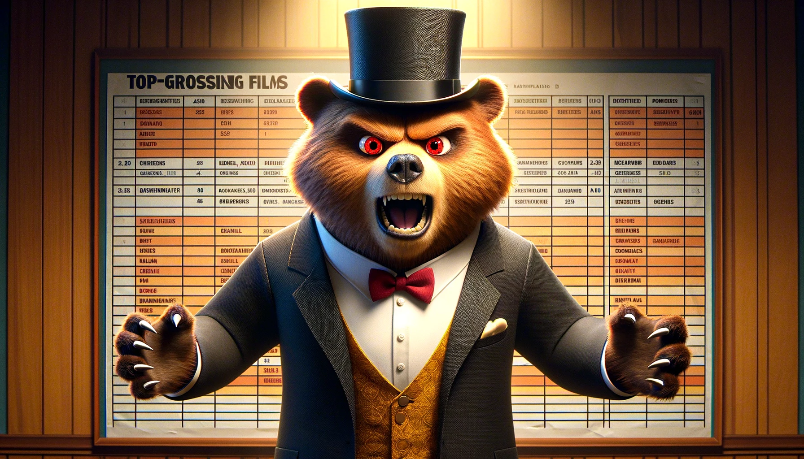

<link rel="stylesheet" type="text/css" href="">

  Imagine possessing a revolutionary tool capable of predicting the success of your movie even before the cameras start rolling.
  This extraordinary tool not only identifies the essential elements your movie might be lacking but also imparts invaluable
  lessons gleaned from the triumphs of films that defied expectations. 
  

    Meet <strong> Professor Zok Omo Predicto</strong>, the charismatic bear with a nose for cinematic success! With a furiously brilliant mind and a heart as warm as his fuzzy exterior, Professor Pawsome Predicto is here to unveil the revolutionary tool that will predict the triumphs of your movie before the first frame is even shot. Get ready to embark on a cinematic journey like never before, guided by the wisdom and wit of this lovable and insightful bear!
  

  Have you ever found yourself completely captivated by a movie, hanging on every twist and turn of the plot until the very end?
  Such is the impact of a well-crafted narrative. Yet, have you pondered the types of stories that consistently seize our attention
  and hold it until the credits roll? In this blog, we embark on an exploration of the most popular narrative arcs in the film
  industry, their profitability, and the evolution of these storylines over time.

# Let us tell you a little story about data

The CMU Movie Summary Corpus Dataset consists of 42,306 plot summaries and its meta data from movies, released in 1893 until 2013. 

<iframe src="assets/plots/genre_revenue.html" width="100%" height="500px" style="border: none;"></iframe>

The story kicks off by exploring 23 distinctive genres. Among them, 22 genres stand individually, each with its unique identity, while the 23rd represents all remaining genres. At the heart of this cinematic journey is the examination of average revenues, revealing a hierarchy that molds the financial destiny of these genres.

At the very top of this list is the fantasy genre, making the most money on average. Following closely are family films, adventures, science fiction, and action genres, each contributing substantially to the financial symphony of the film industry.

However, as the plot deepens, a nuanced reality surfaces. Toward the bottom of the list, the indie and world cinema genres come into focus. Here, films within these genres tend to generate comparatively lower average revenues, adding complexity to the story and emphasizing the delicate balance between artistic expression and financial achievement.

In essence, the narrative paints a vivid portrait of the cinematic landscape, where financial success and artistic expression weave together in a compelling and eternal dance.

The original distribution of the inflated movie box office revenue exhibits a heavy-tailed pattern, with a few movies achieving extremely high revenues. By applying a logarithmic transformation on the x-axis, we "approximate" a normal distribution, making the data more amenable to statistical analyses that assume normality.
<iframe src="assets/plots/box_office_distribution.html" width="100%" height="500px" style="border: none;"></iframe>

Zokomo discovered movie box office revenue data. Inititaly, he noticed that the original distribution of the inflated movie box office revenue exhibits a heavy-tailed pattern, with a few movies achieving extremely high revenues. With a strategic logarithmic transformation on the x-axis, Zokomo reformulated the data, making it resemble a more normalized curve. The aim was to prepare the data for statistical analyses that assumed normality.

Next, we go into the movie summaries to discover a fascinating pattern. Positive words, those feel-good expressions, and their counterparts, the negative ones, each make up 0 to 10 percent of all words in these movie summaries. The rest of the words fall into the neutral territory, lacking any emotional charge.

<iframe src='assets/plots/pos_neg_revenue.html' width="100%" height="500px" style="border: none;"></iframe>

As Zok Omo Predicto looked at positive words in movies, we noticed something interesting. The money these movies made matched up with how many positive words were in their summaries. The best part? Movies with 0% to 2% happy words made the most money on average, while those with 8% to 10% made the least. So, it seems like movies make more money when their summaries aren't too cheerful.

Switching gears to the negative side of the spectrum, we also categorized them into five intervals, ranging from 0-2% to 8-10%. The golden zone emerged between 2% and 4%, with the first interval doing really well and the second grabbing the top spot. Interestingly, the higher the percentage of negative words, the lower the average revenue.  

 
Summing it all up, a general trend emerged. Movies that balanced the good and not-good feelings, favoring a wealth of neutral words in their summaries, tended to bring higher revenue. It seems that maintaining a balanced emotional tone pays off at the box office.

We then observe the mystical relationship between movie duration and average revenue. It reveals that the golden sweet spot for film duration lay between 3 and 4 hours—the fourth interval in our next plot.

<iframe src="assets/plots/runtime_revenue.html" width="100%" height="500px" style="border: none;"></iframe>

        

Initially, the revenue ascend with the runtime, reaching its peak in the fourth interval, only to descend for movies that dared to extend beyond 4 hours.
As we gaze upon the landscape of revenue fluctuations, we notice a curious phenomenon. The first three intervals exhibit little variance, suggesting that movies within these durations dance closely to the mean revenue of their respective intervals. However, the fourth and fifth intervals represent large variance. 

Turning the page, Professor Zok Omo encounter a box plot that deepens the conclusions extracted from the first plot . In this visual enchantment, the best interval (interval 4) emerge with its normal distribution to represent the highest average revenue. The mean and median stand shoulder to shoulder, and not a single outlier dares to disrupt the harmony. The other intervals, however, lack this equilibrium, with some struggling with the absence of the mean=median advantage and others haunted by an excess of outliers. 

In the grand finale of their quest, we conclude that films of a duration between 3 and 4 hours, movies that are between 3 and 4 hours long make more money than all the other movies, whether they are longer or shorter.

  <strong>Professor Zokomo Predicto</strong>, our smart bear guide, is pleased with his movie data findings. Now, he's eager to explore how the language in movies impacts their earnings. Let's find out the interesting discoveries he has in store!

# Language

# countries

Our bear is stunned by the results he got. He observes that the best month to launch a movie is June, with a significant difference (no overlapping CIs), followed by December and July. He assumes that this aligns with the months when students typically have vacations, which might explain the results.

<iframe src="assets/plots/months_revenue.html" width="100%" height="500px" style="border: none;"></iframe>

Zokomo indicates that from now on, as in many following feature analysis, he will be averaging log_revenues instead of averaging revenues. He says " this corresponds to computing the geometric mean instead of an arithmetic mean with the objective of gaining statistical stability. The geometric mean tends to be less sensitive to extreme values (outliers) compared to the arithmetic mean. This makes it a more robust measure in situations where there are significant variations in the data, since it represents better the central tendency. In my case, it is useful to penalize the big variances in revenues thus focusing on the consistency of the contribution of the analysed feature. "

<iframe src="assets/plots/actors_revenue.html" width="100%" height="500px" style="border: none;"></iframe>

Zokomo also says: " With geometric mean for actors, I am favoring those with consistent success over the ones who only participated in a few hits. A clear demonstration is that selecting the top actors with arithmetic mean results in many actors from harry potter or other sagas. This is because there are many film in these sagas with high revenues, which is boosting the actors mean revenues despite them not having much successful movies. "

Zokomo is now interested in the proportion of men and women actors in movies. He decides to analyze whether there is a particular proportion that generates higher box office revenues. To this extend, he is studying the percentage of actresses in movies and how they relate to the box office revenues.

For that, our scientist is trying to perform an equal frequency discretization of the percentage of women, dividing percentages into 8 groups where there is an equal number of movies in each group. He thinks aht by doing it this way, then instead of feeding the final formula with an actual percentage of women, he will only use categorical variables.

<iframe src="assets/plots/women_revenue.html" width="100%" height="500px" style="border: none;"></iframe>

From the plot, Zokomo notices that movies with women percentages between 15% and 21% result in significantly higher box office revenues, followed by movies that have women percentages between 34% and 38%. While movies with 45% to 100% have significantly lower mean box office revenues, and their confidence intervals don't intersect with other intervals.

# conclusion 

# formula 

# conclusion

# outlier above

# outlier below

# final conclusion

